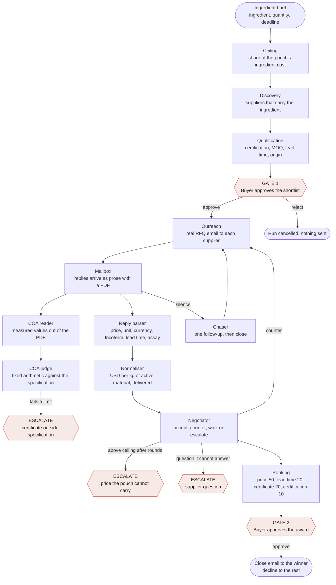

# Aonic sourcing engine

An agent-driven sourcing engine that turns one ingredient brief for Aonic Complete into three to five validated, comparable supplier offers.

It qualifies suppliers, emails them, reads their replies and their Certificates of Analysis, negotiates inside a price ceiling set by the product's own cost, and stops wherever a person should decide.

**Every supplier in this system is simulated.** The email is real and goes only to test inboxes this project owns. No real supplier is ever contacted.

| | |
|---|---|
| Comparison tables | [docs/comparison.md](docs/comparison.md) |
| Outreach and negotiation copy | [docs/copy.md](docs/copy.md) |
| How to run it | [Running it](#running-it) |

---

## The flow



Red nodes are where a person decides. Everything else runs on its own.

---

## The modules

**1. Brief and ceiling.** A brief is an ingredient, a quantity and a deadline. The engine derives the price ceiling itself: each ingredient holds a share of the $12.60 of ingredient cost in a 30-serving pouch of Aonic Complete, and that share divided by the ingredient's mass in a pouch is the most we can pay per kilogram. When the negotiator refuses a price, it refuses because the pouch cannot carry it. CoQ10 gets $400/kg, zinc citrate $17.52/kg and vitamin D3 $560/kg.

**2. Discovery.** Every supplier in the database that carries the ingredient. In production this would be a search across supplier directories, trade databases and past purchase orders. Here it is twelve simulated companies, which keeps the prototype honest about what it has actually tested.

**3. Qualification.** Deliberately rule-based, not a language model. Certification, minimum order quantity, lead time and country of origin are facts, and a buyer has to be able to audit every cut. Each supplier is kept or dropped with its reason written out.

**4. Outreach.** A real Request for Quotation, sent over Gmail SMTP to each qualified supplier. Every message carries a reference code in its subject, which is how a reply finds its way back to the right negotiation.

**5. Reply parser.** Supplier replies arrive as prose written by a person who answered some of the questions, in their own order and their own units. A language model pulls out price, currency, unit, delivery term, lead time, payment terms and assay, and lists anything missing.

**6. COA intake and validation.** The PDF certificate attached to a reply is read by a language model, because every laboratory lays its report out differently. The values it returns are then judged by fixed arithmetic against the target specification, because a laboratory limit is not a matter of opinion. Every line gets a verdict and a load: how much of its limit the measured value uses. A value at 90% of its limit passes and still shows, because it says the next batch might not.

**7. Normaliser.** Converts every quotation to United States dollars per kilogram of active material, delivered to our door. It corrects for currency, for prices quoted per pound, for freight and duty according to the Incoterm, and for assay, since a 98% material contains less of what we are paying for than a 99.5% one. Every step is recorded and shown to the buyer.

**8. Negotiator.** Reads the normalised price, the ceiling, the certificate and every rival offer, then proposes accept, counter, walk or escalate, with its reasoning in plain sentences. The guardrails then bind that proposal: it can never accept above the ceiling, never accept a failed certificate, never exceed the order value limit, never accept a lead time past the deadline, and never go past three rounds. A model that argues for breaking a guardrail simply loses. Counters name the target in the supplier's own currency and unit.

**9. Chaser.** A supplier silent past the follow-up window gets exactly one follow-up. Silence after that closes the file.

**10. Ranking and award.** Offers are scored on normalised price (50%), lead time (20%), certificate (20%) and certification (10%). Walked-away offers stay in the table as real market prices, ranked below anything still in play.

---

## Where the humans sit, and why

Humans sit at the beginning and the end as gates, and in the middle on four triggers. That placement follows one rule: **a person holds every decision that commits the company, and every decision where being wrong is expensive and hard to reverse.**

**Gate 1, the shortlist, before anything is sent.** Contacting a supplier is outward-facing and cannot be undone. A buyer also knows things the system does not: a supplier who let us down last year, a relationship that should not be tested on a small order. The approval screen shows every supplier kept and dropped, with the reason, so the check takes seconds.

**Gate 2, the award, before anything is agreed.** This is the commitment of company money. The buyer sees the ranked table, the normalised price, the certificate status and the rounds it took.

**Four escalations in the middle**, each chosen because an agent acting alone would either create risk or waste the buyer's leverage:

1. **Certificate outside specification.** A batch that fails a heavy metal or microbial limit cannot go into a product on an agent's judgement. The buyer can reject the supplier, ask for a retest, or record a documented waiver.
2. **Price above the ceiling after negotiation.** Only a person can decide the product can carry more cost. The buyer can accept, which raises the ceiling for that run and records that they did, walk away, or hold.
3. **A supplier question the agent cannot answer.** Anything about volumes, exclusivity or future orders is a commercial commitment the agent is not allowed to make.
4. **Rounds exhausted.** After three rounds the agent stops pushing, because a fourth round against a supplier at their floor damages the relationship for nothing.

**Why not more.** Every extra gate is a place the process waits. Reading replies, normalising prices, judging certificates against a written specification and countering inside a set ceiling are all work a person would do identically and slower. Keeping humans out of those steps is what makes the thirty-minute run possible.

**Why not fewer.** A fully autonomous version would email suppliers the buyer never approved and agree terms nobody signed off. Both are cheap to prevent and expensive to undo.

**In production**, each escalation would also send an alert to Telegram or Slack with the same approve and reject choices, so a buyer is pulled back in within seconds wherever they are. In this prototype every gate and escalation lives in the approvals queue in the interface, so a reviewer can act on all of them without access to anyone's phone.

---

## What is real and what is simulated

| Real | Simulated |
|---|---|
| Every email, sent over Gmail SMTP and received over IMAP, with real headers and message IDs | The twelve suppliers, their prices, floors and behaviour |
| Parsing supplier prose with a language model | The Certificates of Analysis, generated as real PDFs with faults planted in four of them |
| Reading the certificate PDFs with a language model | Freight and duty rates per origin |
| Judging every value against the specification | |
| The negotiation decisions, made live by Claude Sonnet 5 | |
| Ingredients and doses, from the published Aonic Complete Supplement Facts panel | |

**Assumptions stated openly.** The internal Aonic Complete specification sheet named in the brief was not available, so the purity limits, contaminant ceilings and certification requirements are ours, written against standard industry practice and labelled as such in the interface. The pouch cost comes from a working cost model, not an Aonic finance document.

**How the simulated suppliers stay honest.** Each supplier knows only its own opening price, its floor and how stubborn it is. It never sees a rival's price. Replies go out as real email and enter the system only when the engine reads them back out of the mailbox, so the parser works on text it did not write.

---

## Running it

### What you need

1. Python 3.12 and Node 20 or later.
2. A free Gmail account with 2-Step Verification on and an [app password](https://myaccount.google.com/apppasswords).
3. A free [Supabase](https://supabase.com) project.
4. An Anthropic API key.

### Set up

```bash
git clone https://github.com/Carldtitan/sourcingagent.git
cd sourcingagent
cp .env.example .env          # then fill it in
pip install -r requirements.txt
npm install
python scripts/migrate.py supabase/schema.sql supabase/seed.sql supabase/002_cost_model.sql supabase/003_files.sql
```

### Run one ingredient from the command line

```bash
python scripts/demo.py zinc-citrate 500 84          # stops at the first human gate
python scripts/demo.py zinc-citrate 500 84 --auto   # answers the gates itself
```

### Run the interface locally

```bash
python scripts/engine_server.py      # the Python engine on :8787
echo NEXT_PUBLIC_ENGINE_URL=http://127.0.0.1:8787 > .env.local
npm run dev                          # the interface on :3000
```

Open http://localhost:3000, pick an ingredient and press **Start sourcing**. The run page checks the mailbox every ten seconds while it is open. Approve the shortlist and watch the replies come in.

### Deploy

The project deploys to Vercel as one app. The Next.js interface serves the pages, and `api/engine.py` runs as a Python function at `/api/engine`. Set the variables from `.env.example` in the Vercel project settings.

### Reproduce the deliverables

```bash
python scripts/run_all.py       # resets the database, runs all three ingredients
python scripts/export_docs.py   # writes docs/comparison.md and docs/copy.md
```

---

## Stack

Next.js on Vercel for the interface. Python for the engine: the qualifier, reply parser, certificate reader and judge, normaliser, negotiator and chaser. Supabase Postgres holds every run, message, quote, certificate and decision. Gmail carries the mail. Claude Sonnet 5 reads replies and certificates and proposes each negotiation move.
